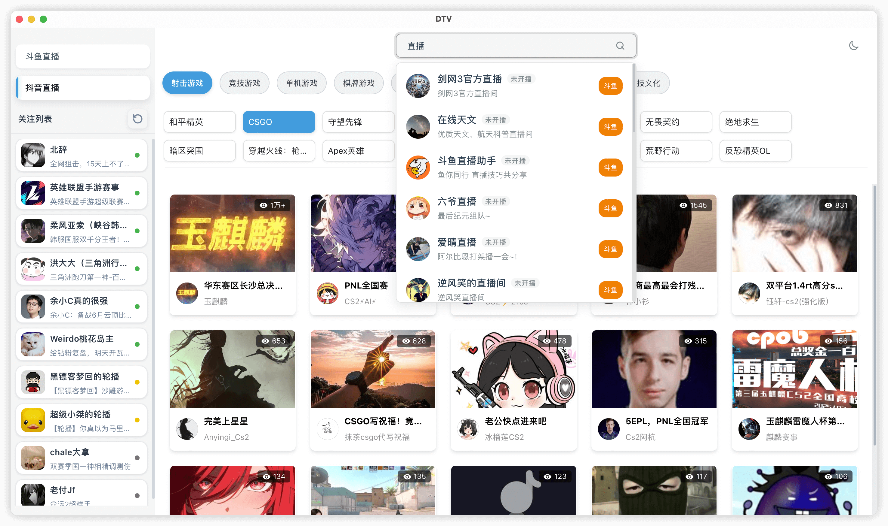
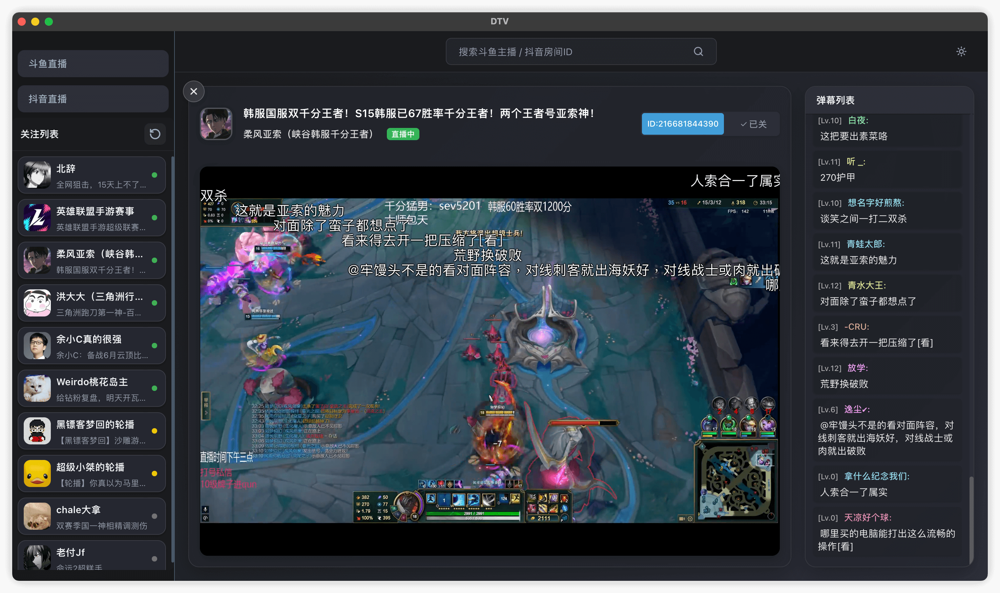

<div align="center">
  
  <h1>DTV</h1>
  <p>基于 Tauri 2.0 的跨平台斗鱼&抖音直播桌面客户端</p>
</div>


## 说明

1. 本项目基于 Tauri 2.0 开发，体积小，占用率低。最初基于 Electron 开发的版本已存放于 [electron-legacy](https://github.com/c-zeong/DTV/tree/electron-legacy) 分支，可以做对比
2. 平台接口有访问频率限制，过于频繁的请求会触发验证码校验，建议合理使用
3. 本项目仅供学习编程目的使用，未进行任何逆向工程

## 功能

- 🔍 主播搜索：斗鱼支持搜索主播名称，抖音只支持搜索房间号
- 📺 直播观看：同时观看斗鱼和抖音双平台主播，真正的原画画质
- 💬 弹幕显示：实时显示直播间弹幕，只显示聊天弹幕，不显示礼物等其他类型弹幕
- ⭐ 主播收藏：支持收藏喜欢的主播，支持收藏列表手动拖拽排序
- 📋 支持平台：Mac(Intel+Arm)，Windows，Linux(包括Ubuntu和各类发行版)
- 🌓 主题切换：支持明暗主题切换

## 软件截图

<div align="center">
  <p>日间模式</p>
  
</div>

<br>

<div align="center">
  <p>夜间模式</p>
  
</div>

## 安装方式

可以在 [release](https://github.com/c-zeong/dtv/releases) 目录下载对应系统的安装包, 也可以通过源码编译安装

## 编译

```bash
# 克隆项目
git clone https://github.com/c-zeong/dtv.git
cd dtv

# 安装依赖
npm install

# 开发调试
npm run tauri dev

# 打包构建
npm run tauri build      # 构建当前系统的安装包
```

##  参考

- 斗鱼直播流获取参考了 [@wbt5/real-url](https://github.com/wbt5/real-url)  
- 抖音弹幕参考了[@saermart/DouyinLiveWebFetcher](https://github.com/saermart/DouyinLiveWebFetcher)
